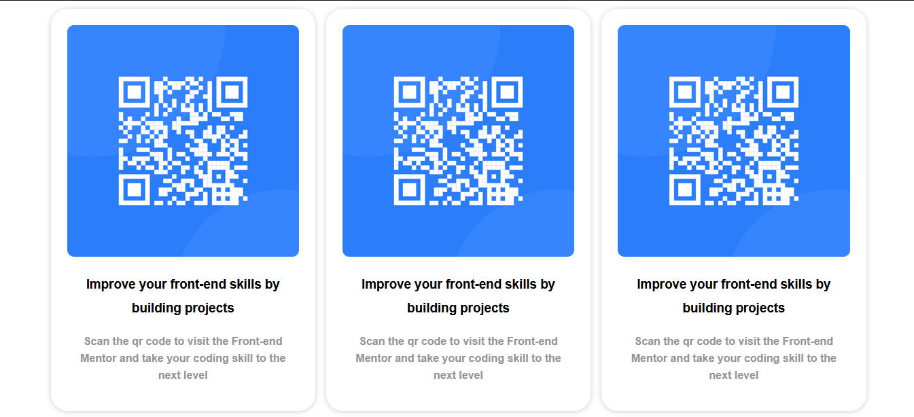

# Frontend Mentor - QR code component solution

This is a solution to the [QR code component challenge on Frontend Mentor](https://www.frontendmentor.io/challenges/qr-code-component-iux_sIO_H). Frontend Mentor challenges help you improve your coding skills by building realistic projects. 

## Table of contents

- [Overview](#overview)
  - [Screenshot](#screenshot)
  - [Links](#links)
- [My process](#my-process)
  - [Built with](#built-with)
  - [What I learned](#what-i-learned)
  - [Continued development](#continued-development)
  - [Useful resources](#useful-resources)
- [Author](#author)
- [Acknowledgments](#acknowledgments)

## Overview

Designing card for housing qr code image to become responsive design

### Screenshot



### Links

- Solution URL: [My Solution](https://github.com/ogibinedi/css-grid-card-element)
- Live Site URL: [My Live Site](https://css-grid-element.netlify.app)

## My process
First i am learning the design and then i create html and finally using reference from the internet how to create responsive page using css grid

### Built with

- CSS Grid

### What I learned

This is the first time i am using css grid to make page responsive and also media query

To see how you can add code snippets, see below:

HTML Part

```html
<div class="cards">
    <div class="card">
      
      <h3 style="text-align: center; margin-left: 10px; margin-right: 10px">Improve your front-end skills by building
        projects</h3>
      <p style="text-align: center; margin-left: 10px; margin-right: 10px">Scan the qr code to visit the Front-end Mentor
        and take your coding skill to the next level</p>
    </div>
    <div class="card">
      
      <h3 style="text-align: center; margin-left: 10px; margin-right: 10px">Improve your front-end skills by building
        projects</h3>
      <p style="text-align: center; margin-left: 10px; margin-right: 10px">Scan the qr code to visit the Front-end Mentor
        and take your coding skill to the next level</p>
    </div>
    <div class="card">
      
      <h3 style="text-align: center; margin-left: 10px; margin-right: 10px">Improve your front-end skills by building
        projects</h3>
      <p style="text-align: center; margin-left: 10px; margin-right: 10px">Scan the qr code to visit the Front-end Mentor
        and take your coding skill to the next level</p>
    </div>
    <div class="card">
      
      <h3 style="text-align: center; margin-left: 10px; margin-right: 10px">Improve your front-end skills by building
        projects</h3>
      <p style="text-align: center; margin-left: 10px; margin-right: 10px">Scan the qr code to visit the Front-end Mentor
        and take your coding skill to the next level</p>
    </div>
    <div class="card">
      
      <h3 style="text-align: center; margin-left: 10px; margin-right: 10px">Improve your front-end skills by building
        projects</h3>
      <p style="text-align: center; margin-left: 10px; margin-right: 10px">Scan the qr code to visit the Front-end Mentor
        and take your coding skill to the next level</p>
    </div>
    <div class="card">
      
      <h3 style="text-align: center; margin-left: 10px; margin-right: 10px">Improve your front-end skills by building
        projects</h3>
      <p style="text-align: center; margin-left: 10px; margin-right: 10px">Scan the qr code to visit the Front-end Mentor
        and take your coding skill to the next level</p>
    </div>
    <div class="card">
      
      <h3 style="text-align: center; margin-left: 10px; margin-right: 10px">Improve your front-end skills by building
        projects</h3>
      <p style="text-align: center; margin-left: 10px; margin-right: 10px">Scan the qr code to visit the Front-end Mentor
        and take your coding skill to the next level</p>
    </div>
    <div class="card">
      
      <h3 style="text-align: center; margin-left: 10px; margin-right: 10px">Improve your front-end skills by building
        projects</h3>
      <p style="text-align: center; margin-left: 10px; margin-right: 10px">Scan the qr code to visit the Front-end Mentor
        and take your coding skill to the next level</p>
    </div>
    <div class="card">
      
      <h3 style="text-align: center; margin-left: 10px; margin-right: 10px">Improve your front-end skills by building
        projects</h3>
      <p style="text-align: center; margin-left: 10px; margin-right: 10px">Scan the qr code to visit the Front-end Mentor
        and take your coding skill to the next level</p>
    </div>
    <div class="card">
      
      <h3 style="text-align: center; margin-left: 10px; margin-right: 10px">Improve your front-end skills by building
        projects</h3>
      <p style="text-align: center; margin-left: 10px; margin-right: 10px">Scan the qr code to visit the Front-end Mentor
        and take your coding skill to the next level</p>
    </div>
    <div class="card">
      
      <h3 style="text-align: center; margin-left: 10px; margin-right: 10px">Improve your front-end skills by building
        projects</h3>
      <p style="text-align: center; margin-left: 10px; margin-right: 10px">Scan the qr code to visit the Front-end Mentor
        and take your coding skill to the next level</p>
    </div>
    <div class="card">
      
      <h3 style="text-align: center; margin-left: 10px; margin-right: 10px">Improve your front-end skills by building
        projects</h3>
      <p style="text-align: center; margin-left: 10px; margin-right: 10px">Scan the qr code to visit the Front-end Mentor
        and take your coding skill to the next level</p>
    </div>
  </div>
```

CSS Part

```css
html {
    font-family: 'Segoe UI', Tahoma, Geneva, Verdana, sans-serif;
}

body {
    padding: 1rem;
}

.cards {
    max-width: 1200px;
    margin: 0 auto;
    display: grid;
    gap: 1rem;
}

.card {
    background-color: white;
    padding: 1.5rem;
    border-radius: 25px;
    box-shadow: 0 1px 8px 0 rgba(0, 0, 0, 0.2);
    object-fit: cover;
}

img {
    border-radius: 10px;
    align-items: center;
    justify-content: center;
    text-align: center;
    width: 100%;
}

h3 {
    font-weight: bold;
    font-family: Arial, Helvetica, sans-serif;
    line-height: 35px;
}

p {
    color: rgb(148, 148, 148);
    font-weight: bold;
    font-family: Arial, Helvetica, sans-serif;
    line-height: 25px;
}

@media (min-width: 600px) {
    .cards {
        grid-template-columns: repeat(2, 1fr);
    }
}

@media (min-width: 900px) {
    .cards {
        grid-template-columns: repeat(3, 1fr);
    }
}
```

### Continued development

i have to learn more as specially in the design part, beside using css grid, i want to learn about how to use flex box semantic etc

### Useful resources

- [resource for learning ](https://travishorn.com) - This website really help me to create responsive web page so i learn a lot from this website.

## Author

- Website - [Ogi Bin Edi](https://github.com/ogibinedi/)
- Frontend Mentor - [@ogibinedi](https://www.frontendmentor.io/profile/ogibinedi)

## Acknowledgments

Special thanks to [Travishorn ](https://travishorn.com) this website really useful you guys can learn a lot from here 

